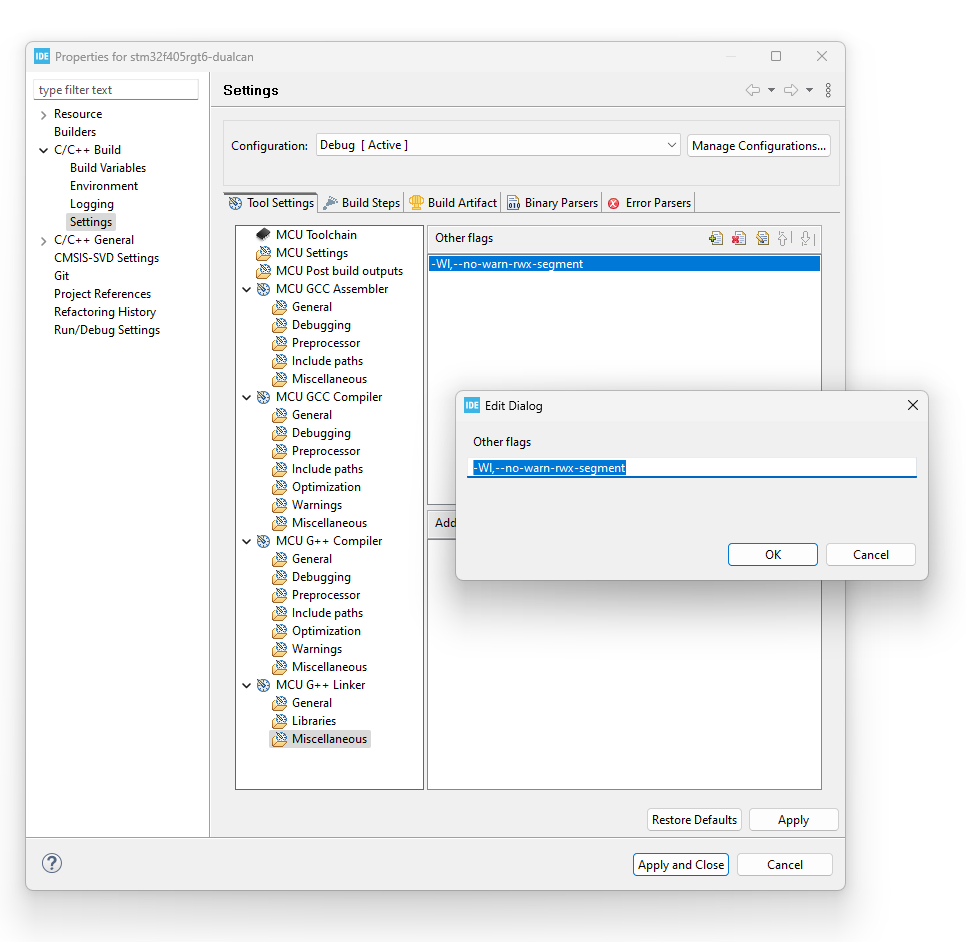

# l8_main

To fix:

C:/ST/STM32CubeIDE_1.14.0/STM32CubeIDE/plugins/com.st.stm32cube.ide.mcu.externaltools.gnu-tools-for-stm32.12.3.rel1.win32_1.0.0.202310241603/tools/bin/../lib/gcc/arm-none-eabi/12.3.1/../../../../arm-none-eabi/bin/ld.exe: warning: l8_disco.elf has a LOAD segment with RWX permissions

Not to link to a simple project no need to link source via a virtual folder.

To link source to a "project" within a Workspace the following will create a folder linking to an external folder: 

Setup a new project:

Add all relaetated projects as references.

Need to add "source  Location"

